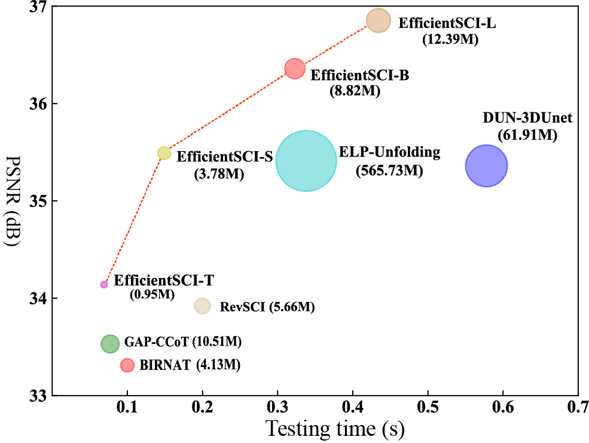

# EfficientSCI
This repo is the implementation of [EfficientSCI: Densely Connected Network with Space-time Factorization for
Large-scale Video Snapshot Compressive Imaging](https://openaccess.thecvf.com/content/CVPR2023/html/Wang_EfficientSCI_Densely_Connected_Network_With_Space-Time_Factorization_for_Large-Scale_Video_CVPR_2023_paper.html).

## Testing Result on Simulation Dataset
<div align="center">
    
  Fig1. Comparison of reconstruction quality and testing time of several SOTA deep learning based algorithms.
</div>

## Installation
Please see the [Installation Manual](docs/install.md) for EfficientSCI Installation. 

## Training and Testing
For training and testing methods, please refer to [STFormer](https://github.com/ucaswangls/STFormer).

## Citation

```
@inproceedings{wang2023efficientsci,
  title={Efficientsci: Densely connected network with space-time factorization for large-scale video snapshot compressive imaging},
  author={Wang, Lishun and Cao, Miao and Yuan, Xin},
  booktitle={Proceedings of the IEEE/CVF Conference on Computer Vision and Pattern Recognition},
  pages={18477--18486},
  year={2023}
}
```
